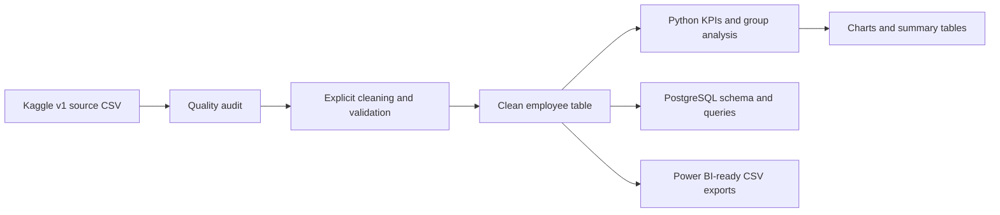
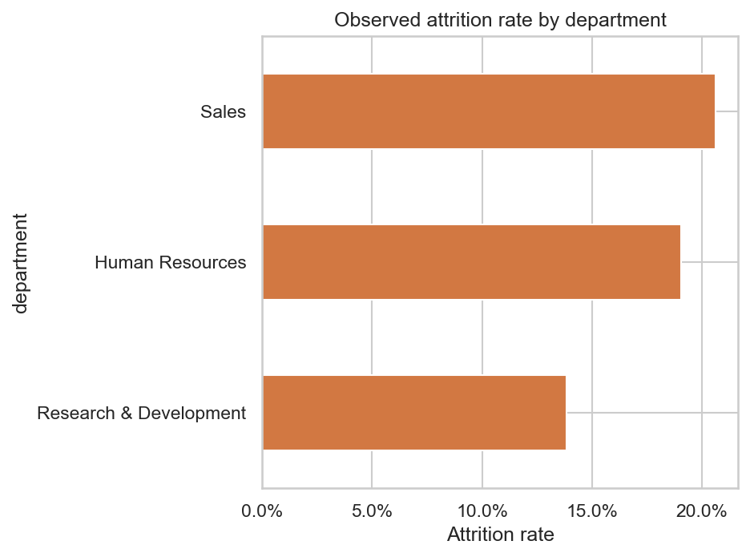
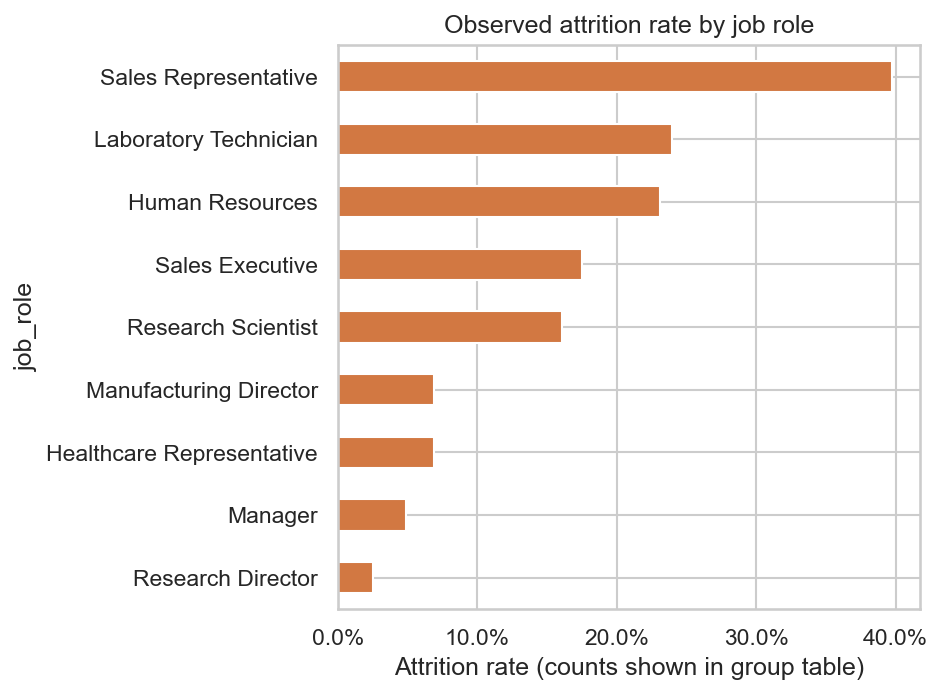
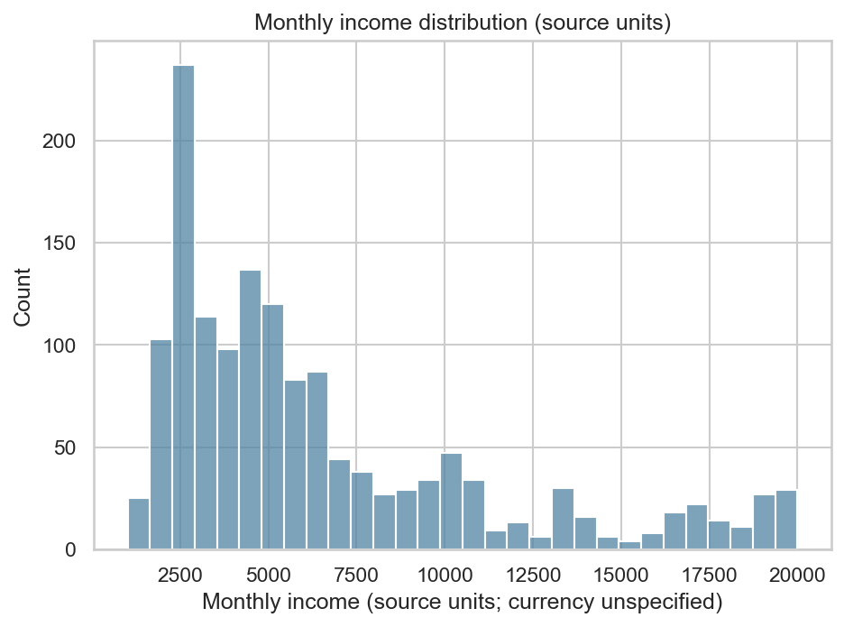

# Employee HR Analytics

Descriptive workforce and attrition analysis using IBM's fictional HR analytics sample. The project audits and validates source data, produces reproducible Python and PostgreSQL analysis, exports Power BI-ready CSV tables, and creates a focused set of charts. It does not build a prediction model or make causal claims.

## Business Questions

- How many employee records and attrition labels are in the sample?
- How does observed attrition vary across departments, job roles, age, tenure, overtime, satisfaction, travel, and income bands?
- What do headcount, tenure, age, income, and overtime distributions look like?
- Which HR measures can be summarized consistently for a dashboard?

## Dataset

The project uses **IBM HR Analytics Employee Attrition & Performance**, distributed as version 1 by Kaggle user `pavansubhasht`. Kaggle's dataset description attributes it to IBM data scientists and calls it fictional; Kaggle metadata labels its license `Database: Open Database, Contents: Database Contents`. The historical IBM Watson Analytics page is the attributed origin, but that old page/download endpoint is no longer accessible at the time this project was prepared. Therefore, Kaggle is the reproducible download source and uploader, not claimed as the original author.

- Download/source page: [Kaggle dataset](https://www.kaggle.com/datasets/pavansubhasht/ibm-hr-analytics-attrition-dataset)
- Historical IBM source reference: [IBM Watson Analytics HR Employee Attrition](https://www.ibm.com/communities/analytics/watson-analytics-blog/hr-employee-attrition/)
- License text: [Open Database License (ODbL) v1.0](https://opendatacommons.org/licenses/odbl/1-0/)
- Pinned source version: Kaggle dataset version 1; the downloader requests version 1 explicitly and verifies the archive SHA-256 recorded in `scripts/download_data.py`.
- Raw shape: 1,470 rows × 35 columns; one fictional employee record per row.
- Attrition label: `Attrition` is Yes/No; it is a sample outcome label, not a time-stamped current employment status.

The sample is synthetic and static. It has no event dates, company context, longitudinal snapshots, or variables needed to establish causation. Its findings cannot be generalized to a real employer or workforce, including Indian employers. Kaggle metadata provides an ODbL database/contents license designation; retain the attribution and share-alike notices when publicly distributing derived databases. The raw file is not committed; run the downloader to obtain it from the pinned source. Provenance limitations and review date are documented in [`docs/sources.md`](docs/sources.md).

## Architecture / Workflow



## Technology Stack

Python, Pandas, PostgreSQL, SQL, Matplotlib, Seaborn, JupyterLab, pytest, SQLGlot (PostgreSQL SQL parsing).

## Data Quality and Cleaning

The pipeline writes a pre-cleaning source audit with row and column counts, duplicates, ID uniqueness, missingness, types, numeric ranges, categorical values, range/consistency checks, constants, and candidate redundant columns. It preserves the source CSV and fails on invalid required data rather than silently repairing observations.

Cleaning standardizes names, renames `EmployeeNumber` to `employee_id`, parses Yes/No fields as booleans, and removes only three audited constant fields: `EmployeeCount`, `Over18`, and `StandardHours`. The ID remains for row-level identification but is not used as an analytical measure. Details and observed decisions are in `docs/methodology.md` and generated in `outputs/tables/`.

## KPI Definitions

| KPI | Definition |
|---|---|
| Employee records | Number of rows after validation |
| Attrition count | Rows where the source `Attrition` label is Yes |
| Observed attrition rate | Attrition count divided by all employee records |
| Not-labelled-attrited count | Rows where the source label is No; not asserted to be currently active |
| Average / median age | Mean / median of `Age` in years |
| Average / median tenure | Mean / median of `YearsAtCompany` in years |
| Average / median monthly income | Mean / median of source `MonthlyIncome`; currency is not specified by the dataset |
| Overtime share | Records labeled overtime Yes divided by all employee records |
| Average job satisfaction | Mean of source 1–4 ordinal score; 1=Low, 4=Very High |

All group attrition rates use attrited records divided by records within that group. Tables include the group denominator. Comparisons do not establish cause. The chart/table analysis flags groups under 20 records and excludes them from the ranked “higher-rate groups” summary while retaining them in descriptive tables.

## Analysis and Key Findings

The verified run on the pinned sample found:

- **1,470** validated employee records; **237** have the source attrition label Yes (**16.1%** of the sample).
- Mean age **36.9 years** (median 36); mean tenure **7.0 years** (median 5).
- Mean monthly income **6,502.9** and median **4,919** in unspecified source units; mean job satisfaction **2.73** on the source 1–4 scale.
- **416** records are labelled overtime Yes (**28.3%**).
- Department observed attrition rates range from **13.8% to 20.6%**.
- Among job roles with at least 20 records, Sales Representative has the highest observed sample rate (**39.8%, n=83**).

These are descriptive results from a fictional sample, not predictions, causal effects, or estimates for a real employer. Small group denominators matter. Full definitions and tables are generated by the reproducible pipeline. Numeric tables and Power BI CSVs are ignored by Git and must be generated locally; the repository includes the chart previews shown below.

## SQL Analysis

`sql/schema.sql` defines one validated employee table. `sql/hr_analysis.sql` contains PostgreSQL queries for overall KPIs, department and role/tenure/age/satisfaction breakdowns, overtime, income medians, minimum-group-size filtering, workforce composition via a CTE/window, a descriptive `CASE` rate band, and income ranking within department/job level. Python and SQL use the same boolean attrition definition and group denominators.

## Visualisations

The pipeline generates seven figures under `outputs/figures/`: department headcount; department attrition; job-role attrition; tenure distribution and attrition; overtime comparison; satisfaction comparison; and monthly-income distribution. They are actual outputs from the pinned dataset and are included as lightweight previews; no raw data is committed. Companion group tables show counts and rates together.







## Power BI Dashboard Specification

The pipeline generates employee-level data, KPI rows, and grouped attrition/income tables under `outputs/powerbi/`. See [`docs/powerbi_dashboard.md`](docs/powerbi_dashboard.md) for a proposed single-page dashboard, measures, and slicers. **The project prepares Power BI-ready CSVs and a dashboard specification; it does not contain a `.pbix` dashboard.**

## Repository Structure

```text
data/       source-download instructions; local raw and processed files are ignored
docs/       data dictionary, methodology, and Power BI specification
notebooks/  two executable analysis notebooks
outputs/    generated charts, audit/tables, and Power BI-ready CSV exports
scripts/    pinned source downloader
sql/        PostgreSQL schema and business queries
src/        audit, cleaning, validation, analysis, and pipeline modules
tests/      focused unit and SQL parsing checks
```

## Reproduction Instructions

The local verification used Python 3.9. The GitHub Actions workflow is configured for Python 3.11; the pinned analytics dependencies also support Python 3.9+.

```bash
python -m venv .venv
source .venv/bin/activate            # Windows: .venv\Scripts\activate
python -m pip install -r requirements.txt
python scripts/download_data.py
python -m src.pipeline
pytest -q
jupyter lab
```

Run notebooks from the repository root. `01_data_quality_and_eda.ipynb` audits and reviews the source and cleaning. `02_hr_analysis.ipynb` runs the analysis pipeline, shows KPI and group results, and displays the charts. To load the processed output into PostgreSQL, create a database, run `sql/schema.sql`, then import `data/processed/employee_analytics.csv` into `public.employee_analytics` using `\copy` or your SQL client. Example `psql` command is documented in `docs/methodology.md`.

## Testing

`pytest -q` checks cleaning behavior, invalid-data failures, KPI and attrition-rate definitions, age/tenure/income groups, small-group ranking rules, and parsing of each SQL statement as PostgreSQL syntax. SQLGlot parsing is a syntax check; it does not verify behavior against a live database.

## Limitations

- Fictional cross-sectional sample; not actual employees or a real employer's data.
- No dates, so no time trend, cohort, or point-in-time headcount analysis is possible.
- No causal inference or intervention effect is estimated.
- Limited features, unclear units for some rate and income fields, and no India-specific company context.
- Small attrition counts within some job-role or demographic groups; always read denominators.
- Dataset license metadata is supplied by Kaggle; the legacy IBM download page is unavailable. Raw data is downloaded, not redistributed here.
- No Power BI `.pbix` file is included. The SQL is syntax-checked; a live PostgreSQL execution has not been verified.

## Future Improvements

Use a licensed, dated, real-world sample with documented company context and privacy safeguards; add HR-approved definitions; and build a `.pbix` dashboard against the exported tables. Any real employee analysis should receive privacy, fairness, and governance review.

## Data Source / Attribution

Contains information from **IBM HR Analytics Employee Attrition & Performance**, downloaded from Kaggle dataset version 1, made available under the Kaggle-listed Open Database License (ODbL) designation. Kaggle distributor: `pavansubhasht`; dataset description attributes the fictional sample to IBM data scientists. See the [Kaggle dataset page](https://www.kaggle.com/datasets/pavansubhasht/ibm-hr-analytics-attrition-dataset), the historical [IBM source reference](https://www.ibm.com/communities/analytics/watson-analytics-blog/hr-employee-attrition/), and the [ODbL v1.0 text](https://opendatacommons.org/licenses/odbl/1-0/). Derived database outputs remain subject to applicable share-alike terms; consult the license before redistributing data or derived databases.

